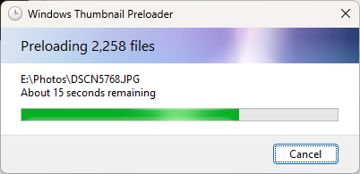

# windows-thumbnail-preloader



`windows-thumbnail-preloader` is a Rust-based command-line application (with an interactive progress dialog) that can be used to facilitate with preloading thumbnails as they appear in Windows Explorer.

## Overview

Generally, when using Windows Explorer, thumbnails for applicable files are generated on a purely on-demand basis; that is, to say, when a thumbnail for a file is requested to be displayed either within the file list view or other means. While this makes sense, it can lead to a less-than-desirable user experience when one is scrolling through a folder of many files whereby thumbnails have not been generated prior. Often, it may take a good few moments for thumbnail generation of the current list of files in view to complete; only amplified by the fact this needs to happen repeatedly for each file.

Instead, this application will iterate through all files within a directory and 'force' Windows Explorer to generate a thumbnail on demand by way of 'requesting' one for each file. An interactive progress dialog will appear for directories that take a longer than a few seconds, as a mechanism for displaying the current progress and providing an easy way to cancel the operation.

Understandably, Windows Thumbnail Preloader will only work on Windows.

## Usage

Preload the thumbnails for items in the current directory:

```
windows-thumbnail-preloader --dir .
```

Preload the thumbnails for items in the specified directory:

```
windows-thumbnail-preloader --dir "E:\Photos"
```

## Installation

For most end-users, the easiest way to install the application is by downloading a pre-built binary. Otherwise, the application can be built from source and installed locally using [Cargo](https://doc.rust-lang.org/cargo/).

## Roadmap

- Ability to skip thumbnails that have already been generated
- Ability to specify a custom thumbnail size
- Ability to hide the progress dialog
- Option to recursively scan for files
- Mechanism for installing as a shell extension to Windows Explorer
- Possibility for localisation of progress dialog strings
